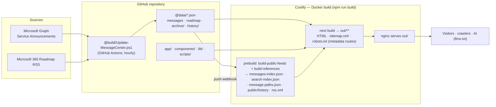
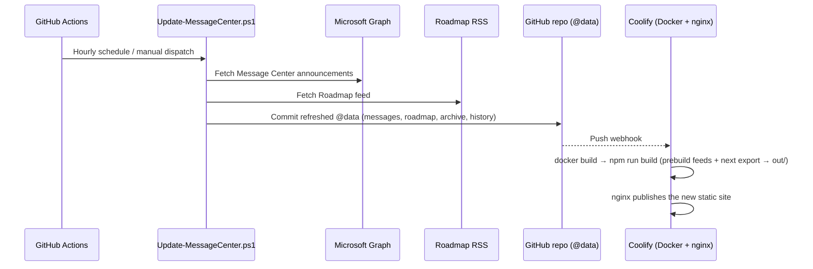
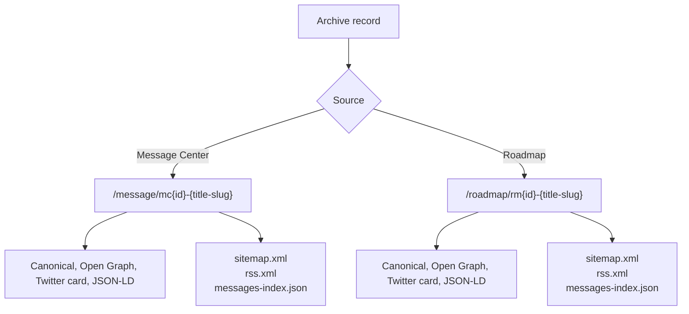
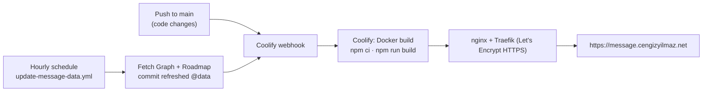

# Microsoft 365 Message Center Archive

Static, searchable Microsoft 365 Message Center and Microsoft 365 Roadmap archive for `message.cengizyilmaz.net`.

This project uses Next.js static export and is served by Coolify (Docker + nginx). It imports Microsoft 365 Message Center data through Microsoft Graph, imports Microsoft 365 Roadmap items from the public roadmap feed, generates machine-readable JSON/RSS/SEO files, and publishes a fully static archive.

## Production Targets

- Site: `https://message.cengizyilmaz.net`
- Parent site: `https://cengizyilmaz.net`
- Hosting: self-managed Docker + nginx (e.g. Coolify) or GitHub Pages via a switch. See [DEPLOYMENT.md](DEPLOYMENT.md).
- Output directory: `out/` (Next.js static export, served by nginx)
- Canonical Message Center route: `/message/mc{id}-{title-slug}`
- Canonical Roadmap route: `/roadmap/rm{id}-{title-slug}`

## Core Capabilities

- Searchable archive for Microsoft 365 Message Center announcements.
- Separate Microsoft 365 Roadmap archive and detail routes.
- Deterministic canonical URLs for Message Center and Roadmap records.
- Service archive pages.
- Message version history and comparison pages (the compare route reads the version pair from `?from=` and `?to=` query parameters client-side).
- RSS feed, sitemap, robots.txt, llms.txt, and AI-friendly JSON index.
- Static export compatible with GitHub Pages.

## Architecture Overview



## Data Pipeline



## Canonical Routing Model



Message Center and Roadmap routes must not be mixed. Roadmap records are never generated under `/message/`, and Message Center records are never generated under `/roadmap/`.

## Deployment Flow



> The default host is a self-managed Docker + nginx server (e.g. Coolify); set
> the `USE_GITHUB_PAGES` repository variable to `true` to serve from GitHub Pages
> instead (no server). See [DEPLOYMENT.md](DEPLOYMENT.md). The data-refresh
> workflow (`update-message-data.yml`) runs the same either way, committing
> `@data`; a push then triggers a rebuild.

## Project Structure

```text
.
├── .github/workflows/        # Data update and GitHub Pages deployment
├── @build/                   # Microsoft Graph and Roadmap update scripts
├── @data/                    # Source and generated archive data
│   ├── archive/              # Per-message archived JSON snapshots
│   └── history/              # Version history per message
├── app/                      # Next.js App Router static routes
├── components/               # Layout, table, message, SEO, UI components
├── config/                   # Site-level configuration
├── lib/                      # Data access, filtering, SEO, slug utilities
├── public/                   # Public machine-readable files and OG assets
├── scripts/                  # Feed, reference, and history generators
├── styles/                   # Global CSS and design tokens
└── types/                    # Shared TypeScript types
```

## Technology Stack

- Next.js 16 App Router with static export.
- React 19 and TypeScript 6.
- Tailwind CSS v4 with local design tokens.
- TanStack Table for large archive browsing.
- GitHub Actions for scheduled data updates (commits to `@data` trigger a Coolify rebuild).
- Microsoft Graph PowerShell SDK for Message Center ingestion.

## Public Files

The exported site includes these public machine-readable files:

- `/messages-index.json` - compact canonical index for active, roadmap, and archived records (AI/machine consumers).
- `/search-index.json` - slim client-side search index (id, title, url, source, services only).
- `/messages-archive.json` - archive-only table index.
- `/rss.xml` - latest Message Center and Roadmap feed.
- `/sitemap.xml` - canonical indexable URLs.
- `/robots.txt` - crawler policy and sitemap reference.
- `/llms.txt` - AI/search consumer guidance.
- `/CNAME` - legacy GitHub Pages custom-domain marker (retained for the manual `deploy-pages` backup; Coolify/nginx does not use it).

## Local Development

Install dependencies:

```bash
npm install
```

Run the development server:

```bash
npm run dev
```

Run static validation:

```bash
npm run lint
npm run typecheck
npm run build
```

`npm run build` refreshes public feed files first, then runs `next build` (Next.js 16 builds with Turbopack by default). Because `next.config.mjs` uses `output: "export"`, production files are written to `out/`.

## Data Updates

For GitHub Actions, create these repository secrets:

- `TENANT_ID`
- `CLIENT_ID`
- `GRAPH_SECRET`

For local data updates, set environment variables or create `@build/config-m365.json` from `@build/config-m365.example.json`. Keep the real config file local and ignored.

```powershell
./@build/Update-MessageCenter.ps1 -GraphSecret "<client-secret>"
```

To refresh only Microsoft 365 Roadmap data:

```powershell
./@build/Update-MessageCenter.ps1 -RoadmapOnly
```

## Security and Data Handling

- Do not commit tenant IDs, client secrets, tokens, `.env` files, or local Graph configuration.
- Keep `@build/config-m365.json` and local secret files out of version control.
- Treat Message Center content as tenant-specific. Always verify tenant applicability in the Microsoft 365 admin center.
- The site is static; no backend runtime or server-side secret access is required.

## Deployment

The same static `out/` can be served two ways, selected by the
`USE_GITHUB_PAGES` repository variable. See [DEPLOYMENT.md](DEPLOYMENT.md) for the
full runbook.

- **Self-managed Docker + nginx (default, e.g. Coolify)** — the host builds
  (`npm ci && npm run build`) and serves `out/`; a push to `main` (or a data
  commit from `update-message-data`) triggers a rebuild via webhook.
- **GitHub Pages (no server)** — set `USE_GITHUB_PAGES=true` and Pages Source =
  GitHub Actions; `deploy-pages.yml` then builds and publishes on push/schedule.

Point `message.cengizyilmaz.net` DNS at the chosen host, and submit
`https://message.cengizyilmaz.net/sitemap.xml` in Google Search Console.

## Files Not Intended for Copy or Commit

Do not copy or commit local/generated working directories and private files:

- `node_modules/`
- `.next/`
- `out/`
- `.env*`
- local logs
- local task notes
- `@build/config-m365.json`
- `@build/secrets-m365.json`

### Original Creator
- **Merill Fernando** - [@merill](https://github.com/merill)

### Current Maintainer
- **Cengiz YILMAZ** - [@cengizyilmaz1](https://github.com/cengizyilmaz1)
- [Twitter](https://x.com/cengizyilmaz_) | [LinkedIn](https://linkedin.com/in/cengizyilmazz) | [Blog](https://cengizyilmaz.net) | [Message Center](https://message.cengizyilmaz.net)

## 📝 License

This project maintains the same open-source spirit as the original. Feel free to fork, modify, and share.

## 🔗 Related Resources

- [Microsoft 365 Admin Center](https://admin.microsoft.com)
- [Microsoft 365 Roadmap](https://www.microsoft.com/microsoft-365/roadmap)
- [Microsoft 365 Service Health](https://status.office365.com)
- [Tenant Finder Tool](https://tenant-find.cengizyilmaz.net)

## 💬 Feedback

For feedback, suggestions, or issues:
- Open an [issue](https://github.com/cengizyilmaz1/MSMessageCenter/issues)
- Connect on [LinkedIn](https://linkedin.com/in/cengizyilmazz)
- Follow on [Twitter/X](https://x.com/cengizyilmaz_)

---

## License

This project keeps the MIT license notice intact where required.
